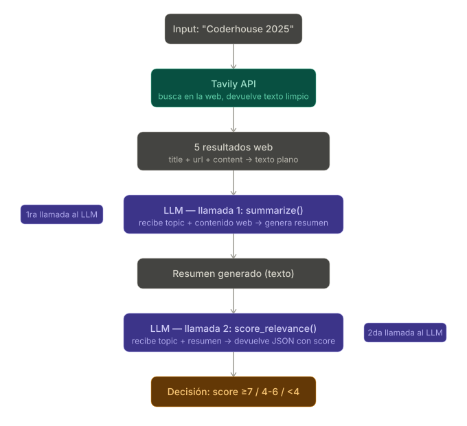
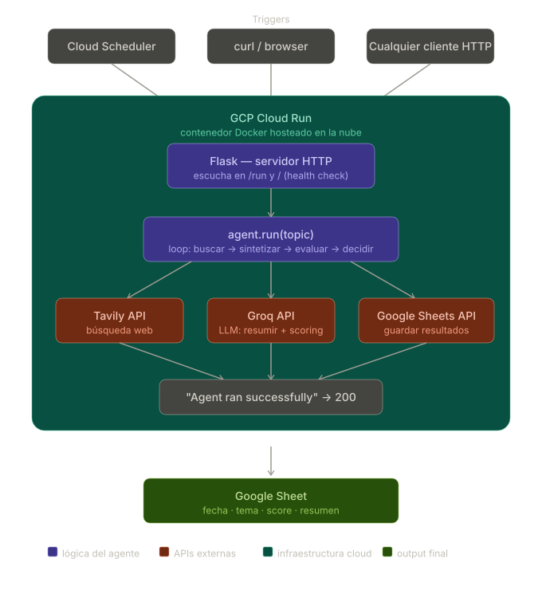

# 🤖 AI Researcher Agent

An autonomous AI agent that researches any topic on the web, synthesizes information using an LLM, and saves structured reports to Google Sheets — running fully in the cloud on GCP.

---

## Architecture


```
Trigger (HTTP / Cloud Scheduler)
         ↓
   Flask HTTP server
         ↓
   agent.run(topic)
    ├── Tavily API      → web search
    ├── Groq API (LLM)  → summarize content
    ├── Groq API (LLM)  → score relevance (self-evaluation)
    └── decision logic  → accept / retry / discard
         ↓
   Google Sheets API   → save results
```

The agent uses a **self-evaluation loop**: after generating a summary, it calls the LLM a second time to score its own relevance (1–10). If the score is too low, it retries with a refined query. This pattern is known as *self-reflection* in agentic AI systems.

---

## Tech Stack

| Layer | Technology |
|---|---|
| Language | Python 3.11 |
| Web framework | Flask |
| Web search | Tavily API |
| LLM | Groq API (Llama 3.3 70B) |
| Output | Google Sheets API |
| Containerization | Docker |
| Cloud deployment | GCP Cloud Run |
| Scheduling | GCP Cloud Scheduler |

---

## Features

- **Autonomous web research** — searches multiple sources per topic via Tavily
- **LLM synthesis** — generates structured summaries with key points and actionable insights
- **Self-evaluation** — scores its own output for relevance (1–10) before saving
- **Retry logic** — automatically refines the query if relevance is low
- **Persistent output** — saves results to Google Sheets with timestamp, score and status
- **Cloud-native** — deployed on GCP Cloud Run, triggerable via HTTP or Cloud Scheduler
- **Provider-agnostic LLM** — swap Groq for Gemini or OpenAI by editing a single file

---

## Project Structure

```
ai-researcher/
├── src/
│   ├── search.py       # Tavily web search + formatting
│   ├── llm.py          # LLM calls: summarize + score_relevance
│   ├── agent.py        # Core agent logic: loop, decisions, retries
│   └── output.py       # Google Sheets integration
├── main.py             # Flask entrypoint
├── .env.example        # Environment variable template
├── requirements.txt
├── Dockerfile
└── README.md
```

---

## Local Setup

### 1. Clone and install dependencies

```bash
git clone https://github.com/leancorv/ai-researcher.git
cd ai-researcher
python -m venv venv
source venv/bin/activate  # Windows: venv\Scripts\activate
pip install -r requirements.txt
```

### 2. Configure environment variables

```bash
cp .env.example .env
```

Edit `.env` with your keys:

```bash
GROQ_API_KEY=your_groq_api_key
TAVILY_API_KEY=your_tavily_api_key
GOOGLE_SHEET_ID=your_google_sheet_id
GOOGLE_CREDENTIALS_JSON={"type":"service_account",...}
```

### 3. Run locally

```bash
python main.py
```

Then call the agent:

```bash
curl -X POST http://localhost:8080/run
```

---

## API Keys

| Service | Free tier | Link |
|---|---|---|
| Groq | 30 req/min, unlimited/day | [console.groq.com](https://console.groq.com) |
| Tavily | 1,000 searches/month | [tavily.com](https://tavily.com) |
| Google Sheets | Free with Google account | [console.cloud.google.com](https://console.cloud.google.com) |

---

## Docker

```bash
# Build
docker build -t ai-researcher .

# Run
docker run --env-file .env ai-researcher
```

---

## GCP Cloud Run Deployment

### Build and push image

```bash
gcloud config set project YOUR_PROJECT_ID
gcloud services enable artifactregistry.googleapis.com run.googleapis.com

gcloud artifacts repositories create ai-researcher \
  --repository-format=docker \
  --location=us-central1

gcloud builds submit --tag us-central1-docker.pkg.dev/YOUR_PROJECT_ID/ai-researcher/ai-researcher
```

### Deploy

```bash
gcloud run deploy ai-researcher \
  --image us-central1-docker.pkg.dev/YOUR_PROJECT_ID/ai-researcher/ai-researcher \
  --platform managed \
  --region us-central1 \
  --env-vars-file env.yaml
```

### Schedule (optional)

```bash
gcloud scheduler jobs create http ai-researcher-weekly \
  --schedule="0 8 * * 1" \
  --uri="https://YOUR_CLOUD_RUN_URL/run" \
  --http-method=POST \
  --location=us-central1
```

---

## Output

Results are saved to Google Sheets with the following columns:

| Column | Description |
|---|---|
| Fecha | Timestamp of execution |
| Tema | Original topic queried |
| Query usado | Actual search query (may be refined) |
| Score | Relevance score 1–10 |
| Estado | `success` / `low_quality` / `discarded` |
| Razón | LLM explanation of the score |
| Resumen | Full structured summary |

---

## Key Concepts Demonstrated

- **Agentic AI patterns** — self-evaluation, retry loops, decision logic
- **Prompt engineering** — structured outputs via JSON prompting
- **Multi-provider LLM architecture** — provider-agnostic design
- **Cloud-native deployment** — Docker + GCP Cloud Run + Cloud Scheduler
- **Secure credential management** — environment variables, no secrets in code

---

## Author

Built by Leandro as a hands-on AI engineering project.  
Stack: Python · Groq · Tavily · Google Sheets · Docker · GCP
